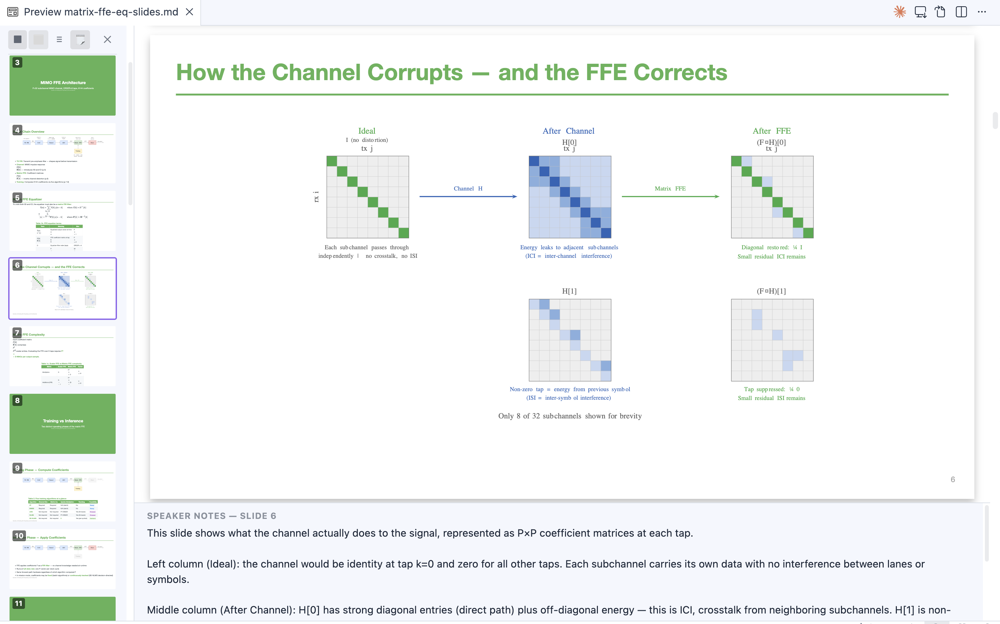
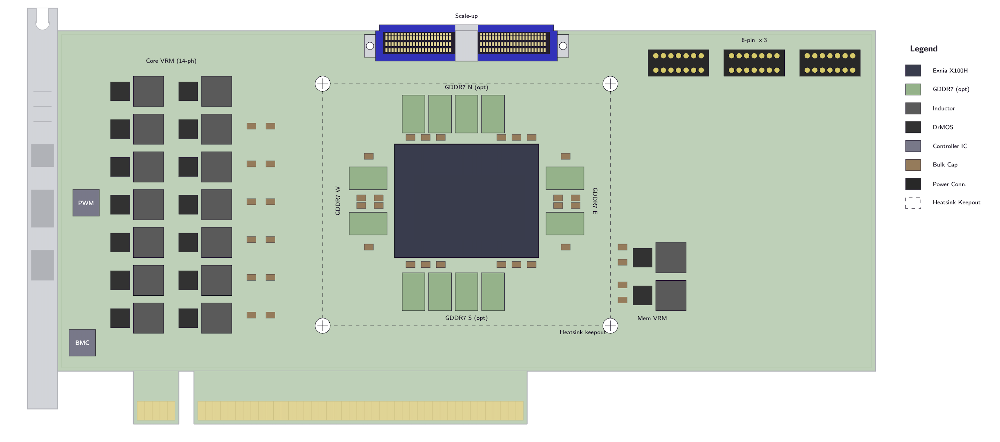
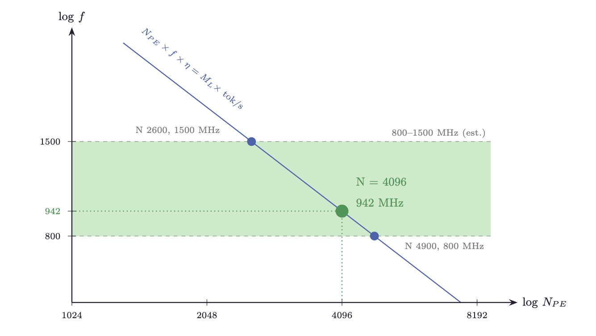
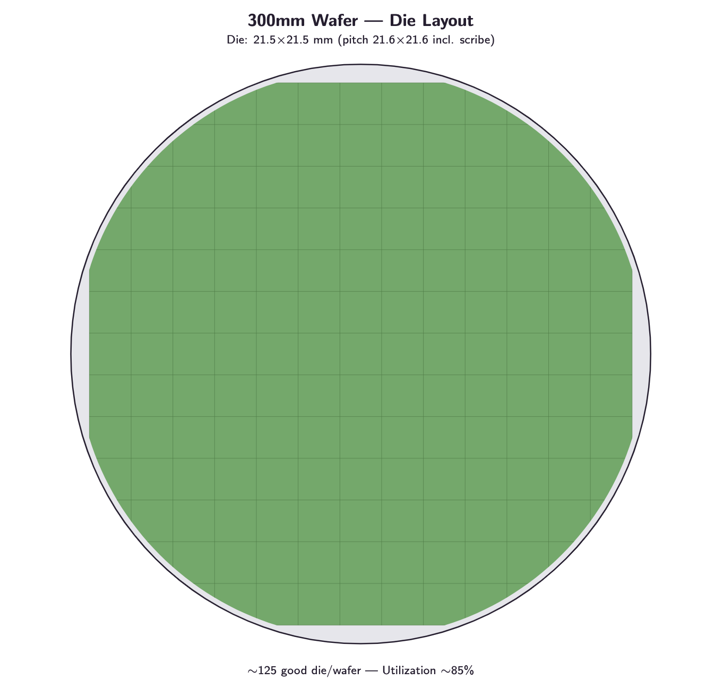
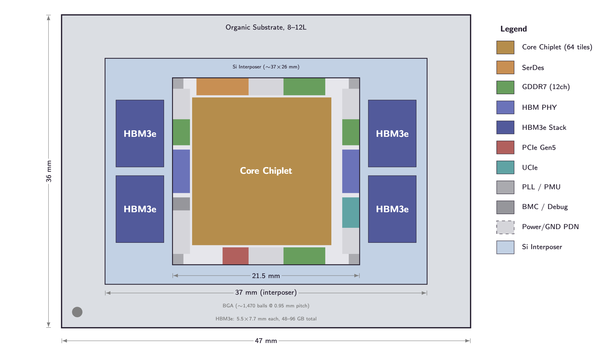

# Marp TikZ Plus

**Build presentations the way you build notes.** Author [Marp](https://marp.app/) slide decks inside your vault with an AI-friendly workflow, a professional authoring experience, and the precision that scientific and engineering presentations demand: TikZ/LaTeX diagrams, a **Slide Navigator**, a **Speaker Notes panel**, and one-click **PPTX/PDF export** with native math objects.

> Desktop only. Rendering runs locally via a WASM-based TeX engine — no internet required.

_Marp TikZ Plus is an independent third-party plugin. It is not affiliated with, endorsed by, or sponsored by the Marp team._

Also available for VS Code: [](https://github.com/kevinyuan/vscode-marp-plus) [](https://marketplace.visualstudio.com/items?itemName=kevinyuan.vscode-tikzjax) [](https://open-vsx.org/extension/kevinyuan/vscode-tikzjax)

---

## Gallery

<table>
<tr>
<td align="center"><em>TikZ diagrams in Marp slides with one-click PPTX export</em></td>
</tr>
<tr>
<td align="center"></td>
</tr>
</table>

<table>
<tr>
<td align="center"><em>PCIe board layout</em></td>
</tr>
<tr>
<td align="center"></td>
</tr>
</table>

<table>
<tr>
<td align="center"><em>Log-log trade-off chart</em></td>
<td align="center"><em>Wafer die layout</em></td>
<td align="center"><em>Package floorplan</em></td>
</tr>
<tr>
<td align="center"></td>
<td align="center"></td>
<td align="center"></td>
</tr>
</table>

More TikZ diagram examples: [Decoding the Taalas HC1 — A Quantitative Analysis](https://kevinyuan1.substack.com/p/decoding-the-taalas-hc1-a-quantitative)

---

## Features

- **TikZ rendering** — Live SVG rendering of `tikz` fenced code blocks in Reading view
- **Rich package support** — chemfig, circuitikz, pgfplots, tikz-cd, tikz-3dplot, amsmath, and more
- **Dark mode** — Automatic color inversion for dark themes
- **External file include** — Reference `.tikz` files with `%!include`; auto-refreshes on save
- **Smart caching** — Two-level cache (memory + persistent); unchanged diagrams load instantly
- **Marp preview** — Full slide rendering via `@marp-team/marp-core` (no other plugins required)
- **Slide Navigator** — Thumbnail sidebar; click any slide to jump to it in the editor
- **Speaker Notes panel** — Live notes extracted from Marp HTML comments, rendered as full Markdown
- **PPTX / PDF export** — Export Marp decks via marp-cli with native PowerPoint math (OMML), not images
- **CJK font injection** — Automatically injects Noto Sans SC so Chinese/Japanese/Korean text renders correctly in exported files

---

## Quick Start

### TikZ diagrams

Add a `tikz` fenced code block in any Markdown file:

````markdown
```tikz
\begin{document}
\begin{tikzpicture}
  \draw[thick, ->] (0,0) -- (2,0) node[right] {$x$};
  \draw[thick, ->] (0,0) -- (0,2) node[above] {$y$};
  \draw[blue, thick] (0,0) circle (1);
\end{tikzpicture}
\end{document}
```
````

Switch to **Reading view** — the diagram renders inline.

### Marp presentations

Add `marp: true` to the frontmatter:

````markdown
---
marp: true
---

# My Presentation

```tikz
\begin{document}
\begin{tikzpicture}
  \node[circle, draw] (a) at (0,0) {A};
  \node[circle, draw] (b) at (3,0) {B};
  \draw[->] (a) -- (b);
\end{tikzpicture}
\end{document}
```
````

Then open the **Marp preview**, **Slide Navigator**, or **Speaker Notes** via the command palette (`Cmd+P` / `Ctrl+P`).

---

## Marp Slide Decks

TikZ diagrams work inside Marp slide decks. Add `marp: true` to your frontmatter and use `tikz` code blocks as usual.

### Diagram sizing in Marp

Marp renders slides at a fixed 1280×720 resolution. TikZ diagrams may appear smaller than in standard Reading view. Use TikZ's `scale` option to compensate:

````markdown
```tikz
\begin{document}
\begin{tikzpicture}[scale=2]
  \draw (0,0) rectangle (3,2);
  \node at (1.5,1) {\Large Hello!};
\end{tikzpicture}
\end{document}
```
````

A `scale=2` factor generally produces a similar visual size to standard Reading view.

---

## External File Include

Store diagrams in separate `.tikz` files and reference them with `%!include`:

````markdown
```tikz
%!include diagrams/circuit.tikz
```
````

The included file should contain complete TikZ code:

```latex
\usepackage{circuitikz}
\begin{document}
\begin{circuitikz}
  \draw (0,0) to[battery1, l=$V$] (0,3)
        to[R=$R_1$] (3,3)
        to[R=$R_2$] (3,0)
        -- (0,0);
\end{circuitikz}
\end{document}
```

- Paths are **relative** to the Markdown file's directory
- The preview **auto-refreshes** when you save the included file
- **Per-file caching** — unchanged files are not re-read or re-rendered

---

## Frontmatter & Speaker Notes Include

Use `%!include` to share YAML theme configuration and speaker notes across multiple Marp files.

### Shared frontmatter

Place `%!include filename.yaml` inside the frontmatter block:

````markdown
---
marp: true
%!include _theme.yaml
author: Alice
---
````

`_theme.yaml` contains the YAML keys to merge:

```yaml
theme: default
paginate: true
backgroundColor: white
```

### Shared speaker notes

Add `%!notes filename.md` anywhere inside a slide body:

````markdown
# My Slide

%!notes notes/slide1.md
````

`notes/slide1.md` can contain any Markdown:

```markdown
## Key points

- Remember to mention the benchmark results
- Audience question likely: *why not use approach X?*
```

Both include types resolve relative paths from the Markdown file's directory and auto-refresh when the included file is saved.

---

## Marp Slide Navigator

Open **Slide Navigator** via the command palette to see slide thumbnails in a sidebar. Click any thumbnail to move the editor cursor to that slide.

- **Keyboard navigation** — Press ↑/↓ in the slide preview to switch pages with smooth animation
- **Speaker notes** — Toggle the notes panel to see per-slide notes rendered as full Markdown

---

## Speaker Notes

Notes are extracted from HTML comments in your Markdown:

```markdown
<!-- This appears as a speaker note for the current slide -->
```

Use **Open Speaker Notes** to open the panel. Notes render as full Markdown — bold, italic, code, lists, tables, headings, and links.

---

## PPTX Export

**Prerequisites** (for PPTX / PDF export only):

- [marp-cli](https://github.com/marp-team/marp-cli) v4.1.0+: `npm install -g @marp-team/marp-cli`
- [LibreOffice](https://www.libreoffice.org/) (required by marp-cli for editable PPTX)

A ribbon icon (file-down) provides quick access to export. Export pipeline:

1. Render all TikZ diagrams to SVG
2. Run `marp-cli --pptx-editable` to produce a `.pptx`
3. Post-process: fix LibreOffice overlay shapes, inject native math (OMML), inject speaker notes
4. Save output next to the source file (timestamped)

### Math in PPTX

LaTeX math in slides is converted to **native PowerPoint math objects** (OMML), not images. Formulas are fully editable in PowerPoint and render crisply at any zoom level.

- Display math (`$$...$$`) is centered with automatic vertical space
- Inline math preserves `\quad`/`\qquad` spacing
- `\mathbf`, `\mathit`, `\hat`, `\sum`, `\prod`, `\int` and other accents/nary operators render natively

---

## Commands

Open the command palette (`Cmd+P` / `Ctrl+P`) and search for **Marp TikZ**:

| Command | Description |
|---------|-------------|
| Open Marp preview | Render the active file as Marp slides |
| Open Slide Navigator | Thumbnail sidebar for the active Marp deck |
| Open Speaker Notes | Notes panel extracted from HTML comments |
| Export Marp slides to PPTX | Export to editable `.pptx` |
| Export Marp slides to PDF | Export to `.pdf` |
| Refresh TikZ diagrams | Force re-render all diagrams in the active file |
| Clear TikZ cache | Wipe cache and force fresh rendering |
| Reset TikZJax engine | Reset the WASM TeX engine |

---

## Settings

Open **Settings → Community Plugins → Marp TikZ**:

| Setting | Default | Description |
|---------|---------|-------------|
| Invert colors in dark mode | `true` | Invert diagram colors when Obsidian uses a dark theme |
| Render timeout (ms) | `60000` | Max time to wait per diagram; increase for complex diagrams |
| Include notes in PPTX | `true` | Embed speaker notes in the PowerPoint notes pane |
| Export format | `pptx` | Default export format (`pptx` or `pdf`) |

---

## Supported Packages

| Package | Purpose |
|---------|---------|
| chemfig | Chemical structures |
| circuitikz | Electronic circuits |
| pgfplots | Function plots and data charts |
| tikz-cd | Commutative diagrams |
| tikz-3dplot | 3D figures |
| amsmath, amssymb, amsfonts | Mathematical notation |
| array | Array and table structures |

---

## Troubleshooting

**Diagrams not rendering** — Switch to Reading view (not Live Preview). Check that the code block uses the `tikz` language identifier.

**Slow rendering** — First render compiles WASM; subsequent renders use the cache. Increase the render timeout in settings for complex diagrams.

**Preview not updating** — Use **Refresh TikZ diagrams**. If that doesn't help, try **Reset TikZJax engine**.

**CJK text in exported files** — CJK font injection is automatic. If Chromium still can't resolve the font, ensure you have internet access during export (the font is fetched from Google Fonts at export time).

**PPTX export fails** — Confirm `marp-cli` and LibreOffice are installed and accessible from your `PATH`.

---

## Acknowledgments

- [node-tikzjax](https://github.com/drgrice1/node-tikzjax) by @drgrice1 — WASM-based TeX rendering engine
- [TikZJax](https://github.com/kisonecat/tikzjax) by @kisonecat — original browser-based TikZ compiler
- [obsidian-tikzjax](https://github.com/artisticat1/obsidian-tikzjax) by @artisticat1 — original Obsidian TikZ plugin
- [@marp-team/marp-core](https://github.com/marp-team/marp-core) — Marp slide rendering engine

---

## License

MIT — see [LICENSE](LICENSE) for details.
